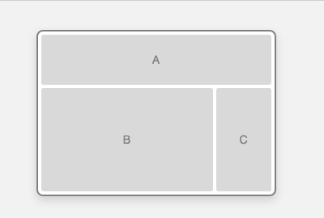
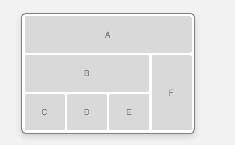
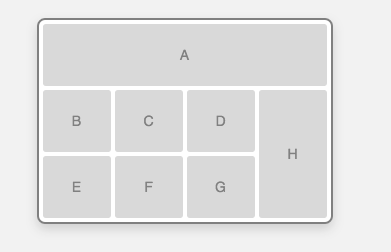
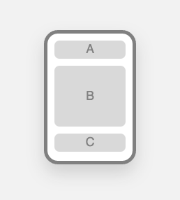
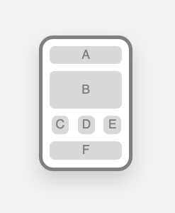
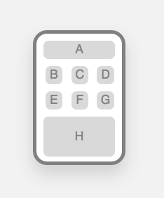
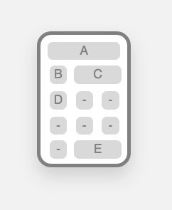

#Design Assessment

###Content Delivery:
1. Two sets of wireframes
2. Styleguide
3. Responsive App

###Objectives:

1.  Design has responsive components
	* At least two break points
	* Desktop and mobile views (mobile views are touch based)
	* Sensible feature parity in both desktop and mobile views
2.  Create a styleguide
3.  Design an application from content inventories using wireframes
		
###Instructions:

1.  Create 5 wireframes that detail the different pages of a site. 
	*  They should look similar to the wireframes provided. Use a system to differentiate the content sections(1,2,3 or A,B,C)

Homepage 

Guided Entry  
	

Promo Entry 
	

	
Product Detail  

Comparison  

#####Create 5 more wireframes that show the mobile view for each of the pages described above. Again, they should look similar to the wireframes provided.

#####Now create a styleguide for your app.
	* Feel free to use [Frontify](https://brand.frontify.com/d/qAiubNBytHKf/style-guide) to help organize it.  
	*  It must include:
		* Typography
		* Audience
		* Proportions
		* Composition
		* Visual hierarchy
		* Color choices
#####Now that you have your wireframes and styleguide, build the app to spec. You don't need content in each section, but you must indentify what each section represents.
	* Keep in mind that it must be responsive @ 2 break points 
	* You can use [this site](http://mattkersley.com/responsive/) to check your work once it is deployed. 

#####You should have these pieces by now:
	* Wireframes
	* Styleguide with link
	* Deployed App

